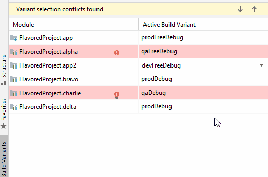
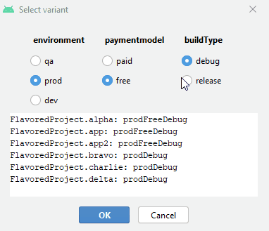

# Build Variant Matrix Selector

A plugin for Android Studio making it easier to select variants / flavors

## Introduction

|Tired of this?|Try this!|
|---|---|
|||

This plugin replaces the variant selector in Android Studio with a popup that lets you select the 
flavors in a matrix instead of using drop down lists. It's much more efficient when working on large projects
in Android Studio.

Here's what I didn't like about Android Studio's solution and why I chose to build this plugin:
 
- If you have multiple leaf modules, there was no
way to select the same flavor for all modules in one operation
- Drop downs lists the options inefficiently* 
- Android Studio's conflict resolution didn't always work**

\*) While drop downs have to list A x B x C selections, where A, B and C are number of 
flavors per dimension, radio buttons can do with A + B + C

 \**) Anecdotal, I haven't investigated deeply. 

## Installation

Requirement: Android Studio 4.0 or newer. 

Go to File - Settings - Plugins, Search for plugin "Build Variant Matrix Selector" 

Optionally [download](https://plugins.jetbrains.com/plugin/15632-build-variant-matrix-selector) and install from disk

## Usage

Go to File - Settings - Keymap - map a key to the action "Select Build Variant by Matrix". Start clicking the button after a proect has loaded, simple as that!

## Known limitations

- Not currently supporting modules that have incomplete dimension configuration. 
   If you have flavor A, B & C for dimension X, you need to have flavor A, B & C in all modules. 

## Acknowledgements

Thants to PandoraMedia's [variant-helper-plugin](https://github.com/PandoraMedia/variant-helper-plugin) for inspiration 